<div align="center">

# burp2model

**Turn a Burp Suite history into an evidence-backed model of a web app.**

Hosts, pages, scripts, endpoints, parameters, auth, and the gaps in what you captured,
each tied to the request that proves it. Query it locally with no AI, or hand the model
to your own AI instead of raw traffic.

[](https://pypi.org/project/burp2model/)
[](LICENSE)
[](tests/)
[](#boundaries)
[](https://falc0n-researcher.github.io/burp2model/)



</div>

---

## Why

Pasting a multi-megabyte bundle and a HAR file into a chat model tends to produce invented
endpoints and generic advice, and it ships your session cookies along with the bytes.
burp2model builds a model first: every endpoint is tied to a real request, paths your code
references but never calls are called out, and what the capture could not show is listed
rather than guessed at. It is a **model builder, not a scanner or exploit tool**.

## Install

```bash
pip install burp2model        # Python 3.9+, no dependencies
```

## Quickstart

```bash
# In Burp: Proxy → HTTP history → select all → right-click → Save items → history.xml
# (a Logger++ CSV export works too)
burp2model history.xml --webapp shop

# Ask it questions, deterministically, with no language model involved
burp2model query shop "code vs runtime"
burp2model query shop list-apis
burp2model query shop help          # every question it answers

# No Burp? Crawl the running app instead (authorized targets only)
burp2model crawl https://shop.example.com/ -w shop --yes
```

Try it without a capture of your own: `./demo.sh` builds the bundled sample.

Output goes to `burp2model-out/shop/`:

| File | What it is |
| --- | --- |
| `report.html` | Self-contained interactive report: map, Ask box, Copy for AI, redacted request/response per request |
| `model.json` | The six-layer graph with an evidence table mapping every `ev_N` to its request |
| `context.json` | The evidence package to give an LLM instead of raw traffic |
| `graph.db` | The model as one SQLite file, queryable with `burp2model q` |
| `graph.json`, `graph.graphml` | The graph for D3, Cytoscape, Gephi, yEd |

## What you get

- **A six-layer model:** edge, routes, client code, APIs (each labelled `BOTH`,
  `STATIC_ONLY` or `RUNTIME_ONLY`), trust, and named unknowns. Every edge is `OBSERVED`
  or `INFERRED`, never mixed.
- **Queries with no AI:** every answer cites evidence ids and ends `Model call: none`.
  A question it cannot answer is refused, not guessed.
- **Copy for AI:** a rules-first context package your own model can reason over.
- **Graph and BQL:** a SQLite graph with a filter-and-path query language.
- **Redaction first:** secrets, cookies, tokens and PII are masked before anything is
  written. Secrets are kept only as a keyed fingerprint (kind, length, entropy).
- **Deterministic:** the same input gives byte-identical output.

## Commands

| Command | Purpose |
| --- | --- |
| `build` (default) | Build the model from a Burp XML or Logger++ CSV export |
| `crawl` | Build the model from a running app in a real browser, no Burp needed |
| `query` | Ask the model a factual question, no AI |
| `q` | Query `graph.db` with BQL |
| `graph` | Reason over the graph, or export GraphML / Cypher / JSON |
| `cross-role` | Compare what two roles reached |
| `gaps`, `changes`, `falsify`, `methodology` | Analyst commands over the model |
| `osint` | External recon for a host (authorized targets only) |

Run `burp2model <command> --help` for options.

## Boundaries

| It does | It never |
| --- | --- |
| Read a capture you exported | Upload, forward or replay it |
| Mask every value before the first write | Store a token, cookie, key or PII value |
| Say what it could not observe | Claim coverage it did not have |
| Offer hypotheses and the evidence to test them | Call anything a vulnerability |

`build` also runs light external recon (DNS, TLS, headers) on the primary host. Turn it off
with `--no-osint` or `BURP2MODEL_OFFLINE=1`. Only use `crawl` and `osint` on systems you are
authorized to test.

CI plants fake secrets in the bundled samples and fails if any appears in any output.

## Documentation

Full site: **[falc0n-researcher.github.io/burp2model](https://falc0n-researcher.github.io/burp2model/)**

- [How it works](docs/HOW_IT_WORKS.md): the pipeline, layer by layer
- [Exporting from Burp](docs/EXPORTING_FROM_BURP.md)
- [Crawling a running app](docs/CRAWLING.md), including scripted journeys
- [Querying the model](docs/QUERYING.md): query, BQL, graph, methodology
- [Using it with AI](docs/USING_WITH_AI.md)
- [Measurements](docs/MEASUREMENTS.md): what Copy for AI saves, and when it doesn't
- [Tested apps](docs/TESTED_APPS.md)
- [Skill](skill/): a no-install playbook that lets any capable AI run the method
- [Changelog](CHANGELOG.md)

## License

Apache-2.0. See [LICENSE](LICENSE).
